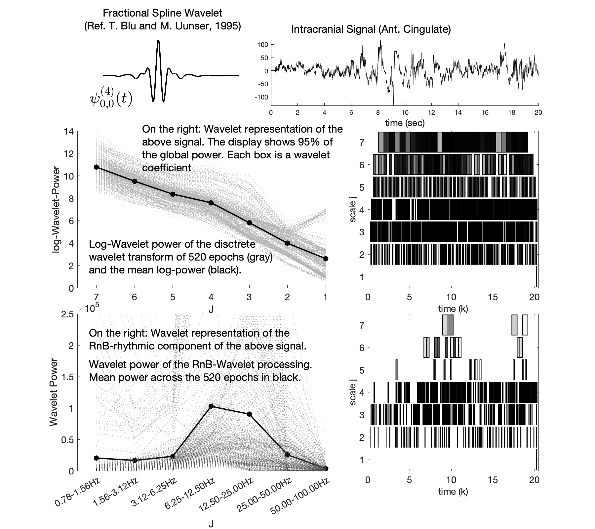

# RnB-Wavelet - EEG spectroscopy

## Description

Current methodologies (Wen & Liu,2016; Donoghue et al.,2020) rely on the Fourier analysis and are limited to disentangling the rhythmic and arrhythmic activities from the Fourier spectral power.

The RnB (rhythms and background) Wavelet model shifts this paradigm by using discrete wavelet analysis, allowing the separation of these components at the signal's temporal level. 

The algorithm extracts a ‘rhythmic signal’ by filtering out the arrhythmic components from the wavelet coefficients.
 
## File structure

- wRnBmain: Main repository containing algorithm to extract rhythmic signal 

## Framework



## Reference

```plaintext
Dubé, J., Foti, M., Jaffard, S., Latreille, V., Frauscher, B., Carrier, J., & Lina, J. M. (2026). Rhythms and Background (RnB):

The spectroscopy of sleep recordings. eneuro, 13(2)
```    
Link: [https://doi.org/10.1523/ENEURO.0235-25.2025](https://doi.org/10.1523/ENEURO.0235-25.2025)

## Contributions

Comments and contributions to this project are encouraged and welcomed.

## Contact

**Email**: jean-marc.lina@etsmtl.ca\
**Email**: michael-christopher.foti.1@ens.etsmtl.ca\
**Email**: jonathan.dube.1@umontreal.ca

## Note

A python implemention is underway.
